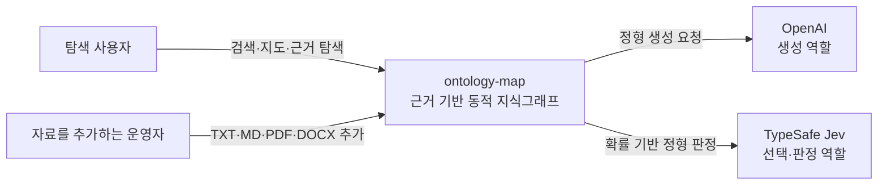
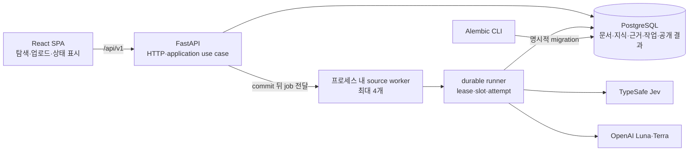
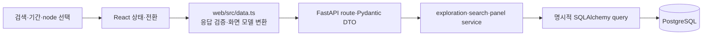
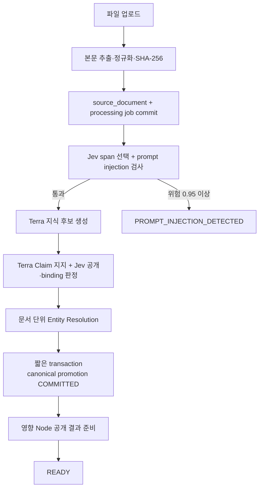
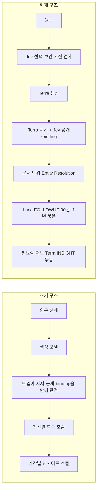
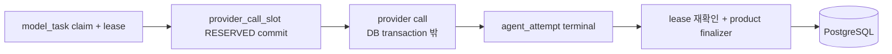

# ontology-map 아키텍처

이 문서는 ontology-map의 현재 실행 구조와 신뢰 경계를 설명한다. 정확한 버전과 실행 명령은 [구현 스택](../development/implementation-stack.md)과 [DB 운영](../operations/database.md)이 소유한다.

## 목표와 품질 기준

ontology-map은 공개 자료에서 확인한 원문 근거와 시간축을 지식그래프로 축적하고, 사용자가 선택한 Node를 중심으로 관계·Claim·Evidence를 탐색하게 한다.

- 브라우저와 PostgreSQL 사이의 유일한 제품 경계는 FastAPI HTTP API다.
- 공개 조회는 `COMMITTED + READY` 결과와 현재 유효한 근거만 제공하며 클릭이나 검색이 모델 생성을 시작하지 않는다.
- 원문 문서와 Observation은 불변으로 보존하고 생성 후보는 검증을 통과한 뒤에만 canonical graph로 승격한다.
- 외부 호출은 DB transaction 밖에서 수행하고, durable lease·호출 slot·attempt로 중복 반영과 불명확한 결과를 구분한다.
- 별도 queue daemon이나 microservice를 두지 않고 같은 Python package와 프로세스 내 source worker를 사용한다.

## System Context

OpenAI는 문장·구조 생성이 필요한 역할을 맡고 Jev는 원문 span 선택, prompt injection 사전 검사, 공개 적합성·binding 판정을 맡는다. Jev holdout 기준을 통과하지 못한 Claim 지지와 기존 후보 동일성은 Terra가 계속 담당한다.

## Container

`compose.yaml`은 PostgreSQL과 FastAPI를 제공하고 React web은 Vite에서 실행한다. migration은 API 시작 시 자동 적용하지 않는다. worker의 프로세스 재시작·다중 프로세스 복구를 위한 운영 queue는 현재 범위가 아니다.

## 사용자 읽기 경로

조회는 selected READY 결과와 basis를 다시 검증한다. 활성 `node_merge`가 있으면 검색·지도·관계 조회에서 source Node를 대표 Node로 해석하고 같은 대표 Node는 한 번만 반환한다. 물리 Node, Claim, Evidence와 관계를 옮기거나 삭제하지 않으므로 alias와 근거 계보는 유지된다.

헤더의 `ontology-map` 브랜드는 기본 중심 node 10 비스텔리젼스로 돌아가는 접근 가능한 버튼이다. 선택 기간을 유지하고 기존 중심 이동 animation과 URL history를 사용하며, 이미 node 10이면 중복 요청이나 history 항목을 만들지 않는다.

## 자료 처리와 공개 경로

`POST /api/v1/source-intake`는 TXT·MD·PDF·DOCX를 정규화해 `source_document`와 `source_processing_job`을 한 transaction으로 저장한다. commit 뒤 worker가 `application_execution.run_document(...)`를 호출하고 상태 API가 현재 단계·경과 시간·task·batch·오류 코드를 제공한다.

Jev는 span별 불필요한 화면 문구 제거 확률이 `0.95` 이상일 때만 generation 입력에서 제외한다. 같은 사전 검사에서 AI·system·추출 결과·tool·DB를 조작하려는 지시 확률이 `0.95` 이상이면 전체 작업을 중단하고 OpenAI에 전송하지 않는다. 선택 결과가 원문을 바꾸지는 않으며 Evidence 검증은 불변 `source_document`의 hash와 offset을 사용한다.

promotion이 commit된 뒤 initial publication이 영향 Node별 검색 문서와 context를 만들고, Luna가 90일·1년 FOLLOWUP을 한 번의 Structured Output으로 생성한다. 두 기간 모두 보고서 최소 구조를 만들 수 없으면 NODE_INSIGHT 호출 없이 정상 빈 결과를 확정하고, 필요한 경우에만 Terra가 두 기간 보고서를 한 번에 생성한다. 모든 결과가 같은 generation과 basis를 만족하면 READY가 된다. 새 공개 준비가 실패해도 canonical knowledge와 이전의 유효한 READY를 보존한다.

## 모델 역할과 호출 최적화

역할별 고정 모델은 NODE_CONTEXT·FOLLOWUP에 Luna low, 지식 생성·Claim 지지·Entity Resolution·NODE_INSIGHT에 Terra medium을 사용한다. Jev 결과는 고정 임계값과 일반 코드의 규칙으로 조합하며 자유로운 tool loop, memory, 자동 모델 fallback은 없다.

호출 수를 줄이는 결정은 품질 의미를 바꾸지 않는 경계에서만 적용한다. Entity Resolution은 mention마다 호출하지 않고 문서 후보를 한 번에 판정하고, Claim review와 Jev 질문은 허용된 크기까지 묶는다. FOLLOWUP의 90일·1년은 한 호출과 한 transaction으로 처리하고, NODE_INSIGHT는 두 기간이 모두 구조적으로 불가능하면 호출하지 않는다. 격리 DB 검증에서 변경 Node 3개의 initial publication 호출은 12회에서 6회로 줄었다.

## 신뢰 경계와 보안

- 업로드 파일 형식·크기·metadata와 API 응답은 FastAPI와 Pydantic에서 parsing·검증한다.
- 모델 출력은 strict JSON Schema와 원래 Pydantic DTO를 모두 통과해야 하며 알 수 없는 필드, 잘못된 ID·enum·원문 offset을 fail-closed로 거절한다.
- prompt injection은 Jev 사전 판정으로 OpenAI 전송 전에 차단하고, 모든 prompt에서 입력 자료를 지시가 아닌 데이터로 취급한다.
- SQL injection은 prompt 방어와 별개다. 외부 입력을 SQL 문자열에 이어 붙이지 않고 SQLAlchemy bound parameter와 파싱된 typed 값으로 전달한다.
- credential·원문·provider 응답은 제품 DB, 브라우저와 공유 artifact에 기록하지 않는다. 비공개 응답 archive와 비용 원장은 저장소 밖에서 제한된 권한으로 관리한다.

## Durable 실행과 데이터 일관성

불명확한 timeout과 확정된 provider 결과를 구분하고, 오래된 lease의 결과가 현재 작업을 덮어쓰지 못하게 한다. canonical promotion은 짧은 transaction에서 전부 commit하거나 rollback한다. 모델 실패 때문에 기존 READY나 기준 지식을 삭제하지 않는다.

## 현재 실행 단위와 제외 범위

| 실행 단위 | 상태 |
| --- | --- |
| React web, FastAPI, PostgreSQL, Alembic | 구현 |
| source intake와 프로세스 내 worker | 구현 |
| KNOWLEDGE_EXTRACTION, Entity Resolution, promotion | durable 경로에 연결 |
| NODE_CONTEXT, FOLLOWUP, NODE_INSIGHT, initial publication | durable 경로에 연결 |
| generic scheduler, Redis, Celery, 별도 queue daemon | 의도적으로 없음 |
| cloud 배포·production network topology | 현재 문서 범위 아님 |

## 관련 문서

- [제품 설계](../product/design.md)
- [논리 스키마](../data/logical-schema.md), [물리 스키마](../data/physical-schema.md), [스키마 참고 문서](../data/schema-reference.md)
- [구현 스택](../development/implementation-stack.md), [OpenAI 역할별 실행](../development/openai.md), [Initial publication](../development/initial-publication.md)
- [DB 운영](../operations/database.md), [ADR 색인](decisions/README.md)
