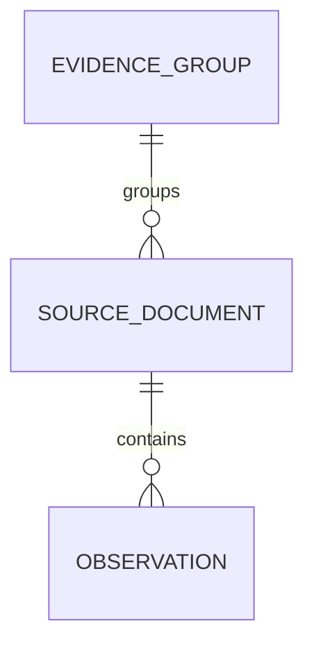
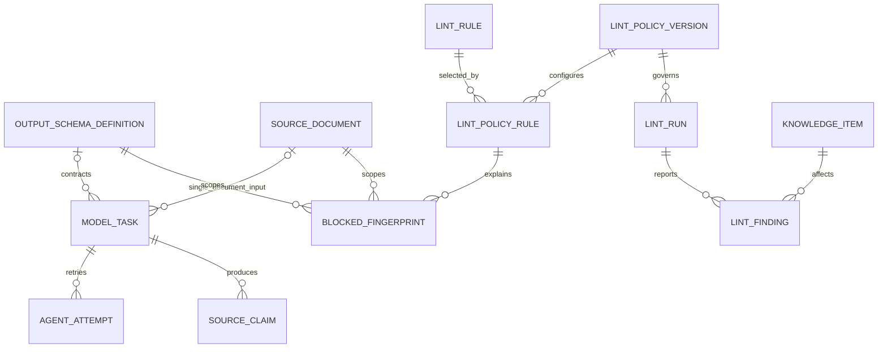
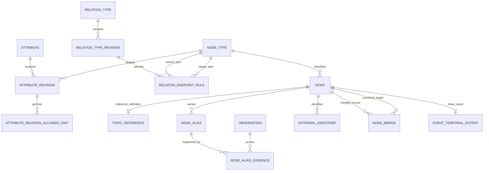
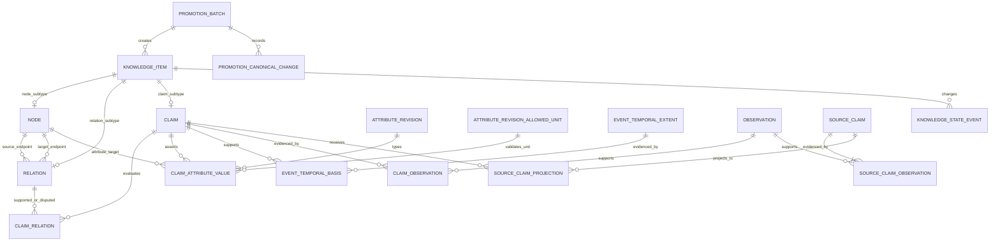
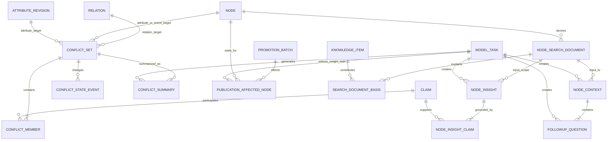

# ontology-map 논리 데이터 스키마

> 상태: Logical Schema v1.3 — Frozen
>
> 변경 기준일: 2026-09-20
>
> 관련 변경: Issue #41, #64, #69, #91, #110, #200, #203, #216, #247
>
> 제품 기준: 공개 자료를 근거와 시간축이 있는 지식그래프로 축적하고, 검색한 노드를 중심으로 탐색하는 HBF POC

## 1. 목적과 경계

이 문서는 사람이 관리하는 도메인 계약이다. 제품 의미, 논리 엔터티, 참조 관계, 카디널리티, 소유권, 수명주기와 무결성 책임을 정의한다. 엔터티·관계·카디널리티·소유권·수명주기가 바뀌는 구현 PR은 이 문서를 함께 갱신한다. PostgreSQL 자료형·DDL·migration과 인덱스 표현식은 [물리 스키마](physical-schema.md), HTTP 표현과 현재 구현 상태는 [제품 설계](../product/design.md)와 [구현 스택](../development/implementation-stack.md)에서 정한다.

Logical Schema v1.3은 다음 원칙을 고정한다.

- 제품 DB는 발견·크롤링 과정이 아니라 정규화한 불변 문서부터 관리한다. 데모에서는 `source-intake` API가 사용자 파일을 정규화해 이 경계로 넘긴다.
- 모든 준비 문서는 저장 시점부터 정확히 하나의 독립 근거 묶음에 속한다.
- Agent 원시 응답과 검증 전 후보 payload는 DB에 저장하지 않는다. 제품 결과는 정확한 Observation과 유효한 의미 대상을 가진 canonical Claim으로만 보존한다.
- 노드·관계·Claim의 의미를 덮어쓰지 않는다. 의미가 바뀌면 새 행이나 새 revision을 만든다.
- 모든 evidence-backed 공개 지식은 Claim과 정확한 observation을 거쳐 `source_document`까지 추적할 수 있어야 한다. 제품 Reference Topic 자체는 Evidence가 아닌 controlled vocabulary이며 별도 lifecycle로 식별한다.
- 기준 지식그래프와 화면용 지식맵을 분리한다. 지도 구성원·좌표·카메라·표시 단계는 기준 데이터로 저장하지 않는다.
- 단일 `confidence`를 만들지 않는다. 모델 실행 성공, 원문 충실성, 지식 상태와 독립 근거 수를 서로 다른 축으로 유지한다.
- 공개 준비 실패는 기준 지식을 되돌리지 않는다. 이전 `READY` 결과를 계속 제공한다.
- 거절된 지식과 이력은 삭제하지 않되 지도와 일반 검색에서는 즉시 제외한다.

## 2. 전체 흐름

아래는 frozen schema의 논리 흐름이며 수집·모델 호출·승격·publication worker가 실행된다는 뜻은 아니다. 현재 실행 범위와 승인된 변경은 [구현 스택](../development/implementation-stack.md)이 구별한다. [#121](https://github.com/studylida/ontology-map/issues/121)에 따라 node embedding과 pgvector 의존성은 frozen baseline에서 제거했으며 검색은 PostgreSQL native FTS를 사용한다.

```text
자료 준비 레이어의 정규화 문서
→ source_key·문서 버전·Evidence Group 확정
→ 불변 source_document 저장
→ 버전이 고정된 Structured Output 계약으로 모델 작업 실행
→ 메모리에서 계약·원문 위치·Claim 지지·publication 적합성과 binding 의미를 문서 단위로 검사
→ Entity Resolution에서 unresolved mention에 의존한 binding만 제거
→ 유효한 binding이 하나 이상 남은 Claim을 짧은 트랜잭션으로 기준 지식그래프에 승격
→ 검색 문서·한국어 맥락·후속 질문·인사이트 생성
→ 영향받은 노드의 공개 준비를 원자적으로 READY 전환
→ 검색·클릭·시간 범위 변경 시 동적 부분 그래프 조회
```

## 3. 논리 ER 구조

### 3.1 준비 문서와 독립 근거



### 3.2 모델 작업과 lint



### 3.3 온톨로지와 노드 정체성



### 3.4 기준 지식과 Evidence Trace



### 3.5 충돌과 공개 파생 결과



## 4. 공통 표준

### 4.1 식별자와 이력

- 모든 기준 엔터티는 이름과 무관한 변경 불가능한 내부 식별자를 가진다.
- 병합된 노드의 ID를 재사용하거나 삭제하지 않는다.
- `knowledge_item`이 `node`, `relation`, `claim`의 공통 식별자를 발급하며 하위 테이블은 공유 기본 키를 사용한다.
- 버전·revision 행은 참조된 뒤 의미 필드를 수정하지 않는다.
- POC 동안 기준 지식, Evidence Trace, 검토·lint·작업 이력과 파생 결과를 자동 삭제하지 않는다.

### 4.2 텍스트와 observation

- 정규화 본문은 UTF-8, Unicode NFC, LF 줄바꿈을 사용한다.
- observation 범위는 Unicode 문자 기준 반열린 구간 `[start_char, end_char)`다.
- 저장 범위에서 잘라낸 문자열, `quote_text`, `quote_hash`가 일치해야 한다.
- 같은 문서의 같은 범위는 observation 하나를 재사용한다.
- 문서 버전이 달라져도 기존 observation을 새 본문 위치로 자동 이동하지 않는다.

### 4.3 시간

| 시간 | 의미 | 활동량 계산 |
|---|---|---|
| `source_document.published_at` | 출처의 최초 게시 시점 | 사용 |
| `source_modified_at` | 출처가 표시한 수정 시점 | 사용하지 않음 |
| `last_checked_at` | 준비 레이어의 마지막 동일성 확인 시점 | 사용하지 않음 |
| `observation.observed_at` | 시스템이 원문 위치를 근거로 식별한 시점 | 사용하지 않음 |
| 사건 시간 | 실제 사건의 시점·기간 | 별도 표시 |
| Claim 주장 시간 | 원문이 Claim에서 명시한 시점·기간 | 별도 표시 |

부분 날짜는 `INSTANT`, `DAY`, `MONTH`, `YEAR`, `UNKNOWN` 정밀도를 함께 가진다. 월·연도는 저장용 시작점으로 정규화할 수 있지만 정확한 날짜로 표시하지 않는다.

## 5. 데이터 사전

### 5.1 `evidence_group`

복제·재게시·확인된 번역 자료를 독립 근거 하나로 세기 위한 최소 식별자다. 대표 문서·대표 해시·표시 이름·문서 수·신뢰도 점수를 저장하지 않는다. 저장 전 계보 판정은 [독립 근거 계보 판정 정책](evidence-lineage-policy.md)을 따른다.

| 필드 | 의미 |
|---|---|
| `evidence_group_id` | 독립 근거 묶음 ID |
| `created_at` | 묶음 생성 시점 |

### 5.2 `source_document`

제품 밖에서 준비한 정규화 문서 한 버전이다. 저장 전 허용 자료와 재처리 경계는 [출처·lint 적재 정책](source-intake-policy.md)을 따른다.

| 필드 | 의미 |
|---|---|
| `source_document_id` | 불변 문서 버전 ID |
| `evidence_group_id` | 현재 독립 근거 계보 묶음. 저장 시 필수 |
| `source_key` | 같은 논리 자료의 버전을 묶는 안정된 키 |
| `version_no` | `source_key` 안에서 1부터 증가하는 버전 |
| `canonical_url` | 사용자에게 연결할 대표 URL. 내부 파일 업로드처럼 URL이 없으면 `NULL` |
| `publisher_name`, `title`, `author_text` | 출처 메타데이터 |
| `original_language` | 본문 언어 |
| `normalized_body`, `body_hash` | 불변 본문과 SHA-256 비교값 |
| `published_at`, `published_precision` | 최초 게시 시점과 정밀도 |
| `source_modified_at`, `modified_precision` | 출처 수정 시점과 정밀도 |
| `last_checked_at`, `last_check_status` | 같은 자료의 마지막 확인 정보 |
| `created_at` | 이 버전 행의 생성 시점 |

`source_key + version_no`는 고유하다. 본문 또는 Evidence Trace에 영향을 주는 버전 메타데이터가 바뀌면 새 행을 만들고, 같으면 마지막 확인 정보만 갱신한다. 별도 `version_fingerprint`는 만들지 않는다.

모든 문서는 생성 시 기존 `evidence_group`을 선택하거나 새 묶음을 만든 뒤 저장한다. 판정 오류는 승인된 정정 경로가 `evidence_group_id`를 직접 수정하고 과거 재분류 이력은 보존하지 않는다. 신호 우선순위, 모호성 처리와 반복 처리 규칙은 [독립 근거 계보 판정 정책](evidence-lineage-policy.md)이 담당한다. 수집 방법·GDELT 응답·HTTP 시도는 저장하지 않는다.

#### `source_processing_job`

사용자 업로드 한 건의 추출·promotion·publication 진행 상태다. `source_document_id`, 상태와 단계, 선택적인 extraction task·promotion batch, 안전한 오류 코드, 시작·종료 시각을 가진다. 상태는 `QUEUED`, `RUNNING`, `READY`, `FAILED`, `INTERRUPTED`, `EXCLUDED_LANGUAGE`이며 한 문서에는 이들 중 재사용 가능한 진행 중 또는 READY job이 최대 하나다. provider 응답 본문이나 원문은 이 행에 저장하지 않는다.

### 5.3 `observation`

특정 불변 문서 버전의 정확한 원문 범위에서 근거를 식별한 기록이다.

| 필드 | 의미 |
|---|---|
| `observation_id` | 관측 ID |
| `source_document_id` | 정확한 불변 문서 버전 |
| `start_char`, `end_char` | Unicode 문자 기준 `[start,end)` |
| `quote_text`, `quote_hash` | 인용문과 SHA-256 검증값 |
| `paragraph_number` | 선택적 보조 위치 |
| `observed_at` | 시스템이 이 범위를 근거로 식별한 시점 |

`source_document_id + start_char + end_char`는 고유하다. 이 행은 출처가 해당 내용을 말했다는 점을 입증하지만 객관적 진실을 입증하지 않는다.

[#139](https://github.com/studylida/ontology-map/issues/139#issuecomment-5580299907)의 승인된 시험은 정확한 문장·표 행을 근거 단위로 허용한다. 모델이 고른 runtime ID를 일반 코드가 위 범위·인용·hash로 복원하는 방식은 이 저장 형태를 재사용할 수 있다. 필요한 선행 문맥·표 머리글은 Claim의 여러 Observation 연결로 표현하며, 시험의 main/context ID·requirement·element를 새 영속 필드로 정의하지 않는다. 최종 추출·저장 대응은 #127에서 검토한다.

### 5.4 모델 실행

#### `output_schema_definition`

모델이 반환해야 할 JSON Schema 계약을 `task_kind + version_no`로 보존한다. 참조된 계약은 수정하지 않고 새 버전을 추가한다. `schema_json`은 계약 정의이며 응답 인스턴스가 아니다.

#### `model_task`

하나의 결정적 모델 작업과 실행 제어를 관리한다.

| 필드 | 의미 |
|---|---|
| `model_task_id`, `task_kind` | 작업 ID와 종류 |
| `source_document_id` | 단일 문서 작업의 선택적 입력 |
| `input_hash` | 실제 전체 입력의 결정적 해시 |
| `output_schema_definition_id` | 정확한 출력 계약 |
| `model_version`, `prompt_version` | 실행 계보 |
| `cache_key` | 작업 종류·입력·계약·모델·프롬프트의 결정적 키 |
| `status` | `PENDING`, `RUNNING`, `SUCCESS`, `RETRY_WAIT`, `VALIDATION_BLOCKED`, `FINAL_FAILED` |
| `attempt_count`, `next_attempt_at` | 실제 호출 수와 다음 실행 시점 |
| `lease_owner`, `lease_expires_at` | 동시 실행 방지 lease |
| `created_at`, `finished_at` | 생성·종료 시각 |

허용 작업은 `KNOWLEDGE_EXTRACTION`, `ENTITY_RESOLUTION_PROPOSAL`, `EVIDENCE_LINEAGE_PROPOSAL`, `CONFLICT_SUMMARY`, `NODE_CONTEXT`, `FOLLOWUP_QUESTIONS`, `NODE_INSIGHT`다. 모든 허용 작업은 정확한 output schema와 prompt version을 가진다.

이 목록은 현재 저장 계약이며 각 작업의 worker·모델 구현 여부는 별개다. 시험용 Selection·Composer·보존 대응·충실도 검증을 각각 새 task kind로 추가한 것은 아니다. 실제 모델·prompt 계보와 기존 작업 종류의 매핑은 제품 adapter 구현 전에 검토한다.

캐시 적중은 호출 횟수를 늘리지 않는다. `SUCCESS`는 결과가 영속 저장소에 연결되었거나 유효 응답에 관련 후보가 없다는 뜻이다.

#### `agent_attempt`

확정된 실제 provider terminal 결과의 append-only 이력이다. `attempt_no = provider_call_slot.slot_no`이며 UNKNOWN slot 때문에 번호 gap이 생길 수 있다. `attempt_count`와 같은 transaction에서 행 수를 유지한다. `model_task_id + attempt_no`가 고유하며 `outcome`, 정형 `failure_reason`, `attempted_at`만 보존한다. 토큰·비용·원시 응답·응답 ID와 중복 모델·프롬프트 필드는 저장하지 않는다.

#### `provider_call_slot`

[#125 승인](https://github.com/studylida/ontology-map/issues/125#issuecomment-5658185041)과 [#124 감사](https://github.com/studylida/ontology-map/issues/124#issuecomment-5658186263)에 따른 최소 실행 제어 구조다. `(model_task_id, slot_no)`가 유일하고 slot_no는 1..3이다. 상태는 RESERVED, COMPLETED, UNKNOWN뿐이다. deterministic local preflight와 request 구성이 끝난 뒤 전송 직전에 RESERVED를 commit하며, UNKNOWN도 소비된 예산으로 유지한다. raw request/response, reasoning과 결과 payload는 저장하지 않는다. runtime helper에는 적용하지 않는다.

확정 결과는 같은 짧은 transaction에서 agent_attempt append, attempt_count 증가, slot COMPLETED와 가능한 task 상태 전환을 기록한다. lease reclaim은 task row lock 안에서 stale RESERVED를 UNKNOWN으로 닫으며 이전 lease의 늦은 결과를 거부한다. hard cap은 terminal attempt 수가 아니라 slot 소비 수로 판단한다. 기존 terminal 이력은 재작성하지 않으며 slot과 대응되지 않는 과거 미완료 task는 예산을 추정해 재실행하지 않는다.

#### `source_claim`, `source_claim_observation`, `source_claim_projection`

이 table들은 중단된 Source Claim 실험에서 생성된 기존 행의 무손실 보존을 위한 호환 구조다. 현재 extraction runtime은 새 Source Claim, observation 연결 또는 projection 연결을 쓰지 않는다. 기존 행은 자동 삭제·변환하거나 새 실행의 성공 증거로 사용하지 않는다.


#### `blocked_fingerprint`

계약 유효 후보가 `BLOCKING` 승격 전 규칙에 실패했을 때 payload 없이 반복 차단 범위만 기록한다.

```text
fingerprint
+ source_document_id
+ output_schema_definition_id
+ lint_policy_rule_id
```

위 조합이 고유하다. 경고, 계약 위반과 모델 장애는 이 테이블에 넣지 않는다.

### 5.5 lint

실제 승격 전·저장 그래프 검사 항목과 `BLOCKING | WARNING` 처리는 [출처·lint 적재 정책](source-intake-policy.md)이 정한다.

- `lint_rule`: 안정된 규칙 코드, 표시 이름, 설명과 평가 범위 `PRE_PROMOTION | PERSISTED_GRAPH | BOTH`
- `lint_policy_version`: 함께 적용할 규칙 선택의 불변 정책 버전
- `lint_policy_rule`: 정책과 규칙을 연결하고 `BLOCKING | WARNING` 심각도를 정함
- `lint_run`: 저장된 기준 그래프 재검사 실행
- `lint_finding`: 열린 문제 인스턴스. `finding_key`, 대상 지식, 최초·최근 run과 시점, 횟수, 메시지·정형 상세, 해결 run·시점·이유를 보존

실패한 run은 finding을 해결하지 않는다. 해결된 문제가 재발하면 새 finding을 만든다. 열린 `BLOCKING` finding은 사람의 지식 상태를 바꾸지 않고 공개 조회에서만 즉시 제외한다.

### 5.6 온톨로지 코드와 revision

POC는 전체 활성 규칙 집합을 `ontology_version`과 `ontology_member` manifest로 저장하지 않는다. 새 지식 생성 가능 여부를 실제 유형·revision 행이 직접 나타낸다.

#### `node_type`

`node_type_id`, 안정된 `node_type_code`, 표시 이름, 생성 규칙과 `is_active`를 가진다. 초기 코드는 `PERSON`, `COMPANY`, `TECHNOLOGY`, `TOPIC`, `EVENT`다. 비활성화는 기존 노드를 삭제·거절·숨김 처리하지 않는다.

#203 이후 `TOPIC` type 자체가 Evidence 예외를 뜻하지 않는다. 기존 evidence-backed TOPIC Node는 기존 lifecycle로 보존할 수 있고, 제품 controlled vocabulary로 만드는 Reference Topic만 `PRODUCT_REFERENCE` lifecycle과 정확히 하나의 `topic_reference` 정의를 가진다. 일반 Agent/entity-resolution 경로는 새 TOPIC Node를 만들지 않고 active Reference Topic만 재사용한다.

#### `topic_reference`

제품 정의 Topic의 1:1 reference definition이다. 공유 `node_id` 정체성을 유지하면서 stable `topic_code`, canonical 표시 이름, `is_active`를 소유한다. canonical 이름은 `node_alias`나 외부 Evidence가 아니라 이 정의가 source of truth다. `is_active=false`는 새 `HAS_TOPIC` mapping 생성만 막으며 기존 Topic Node나 과거 Relation을 삭제·비공개·재해석하지 않는다. #203이 schema와 activation/read boundary를 제공하고 #201의 별도 idempotent activation이 승인 Topic 9개 row를 실제 제품 reference data로 만든다. 활성 목록과 실행 경계는 [승인 ontology reference data](ontology-reference-data.md)가 소유한다.

#### `relation_type`, `relation_type_revision`, `relation_endpoint_rule`

`relation_type`은 불변 `relation_code`를 관리한다. `relation_type_revision`은 `relation_type_id`, `version_no`, 표시 이름, `DIRECTED | SYMMETRIC`, 선택적 역관계 revision과 `is_active`를 가진다. 같은 관계 코드에는 활성 revision이 최대 하나다.

`relation_endpoint_rule`은 revision마다 허용되는 `source_node_type_id + target_node_type_id` 조합을 저장한다. `SYMMETRIC` revision에는 역관계를 둘 수 없다. 사용된 revision의 의미·방향·역관계·endpoint 규칙은 수정하지 않는다.

#### `attribute`, `attribute_revision`, `attribute_revision_allowed_unit`

`attribute`는 불변 `attribute_code`를 관리한다. `attribute_revision`은 `attribute_id`, `version_no`, 표시 이름, 정확히 한 `target_node_type_id`, `allowed_value_kind`, `is_active`를 가진다. 같은 속성 코드에는 활성 revision이 최대 하나다.

`attribute_revision_allowed_unit`은 NUMBER revision이 허용하는 정확한 `unit_code` 집합을 저장한다. 단일 단위 NUMBER 속성은 한 행, 복수 단위 NUMBER 속성은 같은 revision에 여러 행을 가진다. 이 집합은 canonical 단위를 고르거나 환산·정규화·단위 간 비교 규칙을 뜻하지 않는다. NUMBER가 아닌 revision에는 허용 단위 행을 두지 않는다. revision을 사용할 때 NUMBER에는 허용 단위가 최소 하나 있어야 하며, 사용된 revision과 그 허용 단위 집합은 의미를 바꾸지 않는다.

`is_active = false`는 기존 지식의 의미나 공개 상태를 바꾸지 않는다. 승격 서비스는 사용할 유형·revision의 활성 상태를 트랜잭션 안에서 다시 확인한다.

### 5.7 노드 정체성

- `node`: 공유 기본 키 `node_id`와 안정된 `node_type_id`
- `node_alias`: `node_alias_id`, `node_id`, `alias_text`, `language`, `is_preferred`
- `node_alias_evidence`: alias와 observation의 다대다 근거 연결
- `external_identifier`: 신뢰된 준비 메타데이터의 외부 체계와 값
- `node_merge`: 원본→기준 노드 리디렉션, 병합·취소 이유와 시점
- `event_temporal_extent`: 사건 노드의 시작·종료 값과 precision

검색은 모든 alias를 대상으로 한 뒤 활성 병합을 따라 최종 노드로 이동하고 대표 alias만 표시한다. 원본당 활성 병합은 최대 하나이며 자기 참조와 순환을 허용하지 않는다. 사람 처리자 FK는 관리자·인증 기능까지 보류한다.

### 5.8 기준 지식

#### `promotion_batch`

검증된 결과를 짧은 트랜잭션으로 기준 그래프에 원자 저장하고 이후 공개 준비 상태를 관리한다. 전체 활성 온톨로지 snapshot ID는 저장하지 않는다.

| 필드 | 의미 |
|---|---|
| `promotion_batch_id` | 묶음 ID |
| `lint_policy_version_id` | 승격 전 검증 정책 |
| `promotion_status` | `PENDING | COMMITTED | FAILED` |
| `publication_status` | `NOT_STARTED | PREPARING | READY | FAILED` |
| `started_at`, `committed_at`, `ready_at` | 단계별 시각 |
| `promotion_failure_reason`, `publication_failure_reason` | 서로 분리된 실패 이유 |

#### `promotion_canonical_change`

기존 canonical object를 재사용하면서 이번 promotion이 실제로 새 association/change를 만들었지만 기존 schema만으로 batch attribution을 복원할 수 없는 경우만 기록하는 immutable provenance다. 새 Node·Relation·Claim 자체는 계속 `knowledge_item.promotion_batch_id`를 사용하며 이 테이블에 중복 기록하지 않는다.

허용 `change_kind`는 `NODE_ALIAS_CHANGED`, `NODE_ALIAS_EVIDENCE_ADDED`, `CLAIM_OBSERVATION_ADDED`, `CLAIM_RELATION_ADDED`, `CLAIM_ATTRIBUTE_VALUE_ADDED`, `EVENT_TEMPORAL_BASIS_ADDED` 여섯 종류로 닫혀 있다. exact target은 각각 `node_alias_id`, `(node_alias_id, observation_id)`, `(claim_id, observation_id)`, `(claim_id, relation_id)`, `claim_attribute_value_id`, `(event_node_id, claim_id)`다. association target은 가능한 경우 원본 association의 복합 키를 FK로 직접 참조한다.

이 provenance는 publication job/state, affected Node, retry attempt, staging/result payload 또는 generic event log가 아니다. 실제 canonical mutation과 같은 promotion transaction에서만 기록하고 실제 no-op/retry에는 새 provenance를 만들지 않는다. migration 이전 historical association은 timestamp나 row 순서로 추정 backfill하지 않는다.

#### `knowledge_item`, `knowledge_state_event`

`knowledge_item`은 ID, `item_kind`, `lifecycle_kind`, `current_state`, `promotion_batch_id`, `created_at`을 가진다. 정확히 하나의 `node`, `relation`, `claim` 하위 행과 대응한다.

`EVIDENCE_BACKED` lifecycle은 기존 지식 계약으로 `current_state`와 `promotion_batch_id`가 모두 필수이며 Evidence Trace·lint·publication을 그대로 따른다. `PRODUCT_REFERENCE`는 승인된 Reference Topic Node에만 허용되고 두 값은 모두 비어 있어야 한다. 이 NULL 허용은 기존 지식 제약 완화가 아니라 lifecycle별 조건부 무결성이다. Reference Topic 자체에는 가짜 `EVIDENCE_VERIFIED`, promotion batch 또는 publication READY를 만들지 않는다.

초기 `근거 확인됨`은 evidence-backed 시스템 생성 상태이며 사람 이벤트를 만들지 않는다. `knowledge_state_event`는 사람의 상태 변경만 append-only로 기록한다. 처리자 물리 계약은 관리자 기능까지 보류한다.

#### `relation`

`relation_id`, endpoint 두 개, 생성 당시 `relation_type_revision_id`, 결정적 `relation_identity_key`를 가진다. 사건 맥락은 사건 노드를 명시적 endpoint로 사용하는 경로로 저장하고 relation 유효 기간은 두지 않는다. 관계 승격에는 observation이 있는 지지 Claim이 최소 하나 필요하다.

#### `claim`, `claim_relation`, `claim_observation`

`claim`은 공개 graph로 투영된 canonical Claim이다. 공유 ID, 원자적 문장, 언어, modality, 주장 시간 양쪽 값과 precision을 가진다. 모든 Claim은 observation을 최소 하나 가지며 관계·속성값·사건 시간 중 최소 한 의미 대상과 연결된다. 이 조건을 충족하지 못한 새 결과는 제품 DB에 저장하지 않고 task를 `VALIDATION_BLOCKED`로 끝낸다.

`claim_relation`은 `(claim_id, relation_id)`와 `SUPPORT | DISPUTE` stance를 가진다. `claim_observation`은 Claim과 observation의 다대다 연결이다.

공동 수행 사실을 회사별 독립 수행으로 바꾸지 않고 Claim 하나에서 여러 Relation으로 표현하는 방향은 [#127의 세션 결정](https://github.com/studylida/ontology-map/issues/127#issuecomment-5580300060)을 따른다. 현재 연결 구조는 이를 수용할 수 있지만, 어떤 Relation·사건·attribute로 대응시킬지는 활성 ontology와 추출 계약 검토가 필요하다. 문서화만으로 새 유형이나 자동 저장 규칙을 승인하지 않는다.

#### `claim_attribute_value`

Claim이 노드의 구조화 속성을 주장하는 tagged union이다. 공통 식별자·대상·revision·`value_kind`와 문자열, 숫자+단위, 날짜·기간+precision, Boolean 값 컬럼을 가진다. 허용 종류는 `STRING`, `NUMBER`, `DATE`, `PERIOD`, `BOOLEAN`이다.

NUMBER 값은 원문에서 추출한 `number_value`와 `unit_code`를 그대로 저장한다. `(attribute_revision_id, unit_code)`는 해당 revision의 `attribute_revision_allowed_unit`에 존재해야 한다. 저장 과정에서 canonical 단위를 선택하거나 값을 환산·정규화하지 않으며 서로 다른 허용 단위의 값을 자동 비교하지 않는다.

#### `event_temporal_basis`

`(event_node_id, claim_id)`로 채택 사건 시간과 이를 직접 뒷받침하는 Claim을 연결한다. 다른 시간을 주장하는 Claim은 별도 충돌 묶음으로 보존한다.

### 5.9 충돌

- `conflict_set`: 관계, `(target_node_id + attribute_revision_id)`, 사건 시간 중 정확히 한 대상 형태와 modality, 상태, 생성 시각
- `conflict_member`: `(conflict_set_id, claim_id)`와 `position_key`
- `conflict_state_event`: 사람의 확인·거절 이력
- `conflict_summary`: set, 성공한 요약 작업, 공통점·관점 요약, 생성 시각

대상·modality·구성 Claim·position은 불변이다. 구성 변경은 새 snapshot을 만들고, 같은 구성에서 모델·프롬프트만 바뀌면 새 summary만 추가한다.

### 5.10 검색과 공개 파생 결과

- `publication_affected_node`: `(promotion_batch_id, node_id)`와 선택된 `node_search_document_id`, `node_context_id`, `node_insight_model_task_id`
- `node_search_document`: `node_id`, `identity_text`, `knowledge_text`, `input_hash`, `generator_version`, `created_at`
- `search_document_basis`: 검색 문서가 사용한 공개 `knowledge_item`
- `node_context`: 검색 문서에서 만든 한국어 설명
- `followup_question`: 전환 호환용 이동 질문. 기존 context의 slot 1·2와 `target_node_id`를 보존하며 새 화면의 질문 계약에는 사용하지 않는다.

새 공개 계약은 모든 영향 node의 검색 문서·context와 같은 context의 두 기간별 질문 묶음, 성공한 `NODE_INSIGHT` 작업의 두 기간별 준비 결과가 완결되고 공개 조건을 통과해야 READY로 전환한다. 성공한 0개 질문·0개 보고서는 정상이며 묶음 부재·실패와 구분한다. 기존 READY를 새 형식으로 자동 변환하거나 재검증 실패 때문에 기준 지식을 되돌리지 않는다. source intake의 프로세스 내 worker가 이 생성·publication 경로를 실행하며, 읽기에서도 준비·근거 검사를 다시 수행한다.

### 5.11 node 인사이트

`node_insight`는 한 node의 한 공개 검색 문서와 한 `NODE_INSIGHT` 모델 작업에서 생성한 제목 있는 불변 분석 리포트다. `node_context`의 일반 맥락 설명이나 `followup_question`을 대체하지 않는다.

| 필드 | 의미 |
|---|---|
| `node_insight_id` | 불변 인사이트 ID |
| `node_id` | 중심 node |
| `node_search_document_id` | 생성 입력의 공개 지식 범위 |
| `model_task_id` | 두 시간 범위를 함께 처리한 성공 작업 |
| `time_window` | `RECENT_90_DAYS | RECENT_1_YEAR` |
| `as_of_at` | 상대 기간 계산 기준 시각 |
| `slot` | 같은 작업·시간 범위의 표시 순서 1–3 |
| `title` | 목록 제목 |
| `summary_text` | 짧은 요약 |
| `synthesis_text` | 여러 Claim과 Relation을 종합한 모델 해석 |
| `caveat_text` | 근거 한계와 주의점 |
| `created_at` | 불변 결과 생성 시각 |

`node_insight_claim`은 인사이트가 실제로 사용한 기존 Claim을 `KEY_CLAIM | SUPPORTING_CLAIM | CONTRASTING_CLAIM` 역할과 표시 순서로 연결한다. 한 인사이트에는 Claim과 `KEY_CLAIM`이 각각 최소 한 건 필요하며 Claim 문장, Relation과 원문을 복사한 별도 사실 행을 만들지 않는다.

```text
node_insight
→ node_insight_claim
→ claim
→ claim_observation
→ observation
→ source_document
→ evidence_group
```

목록의 근거 수는 저장하지 않고 선택 시간 범위의 `COUNT(DISTINCT source_document.evidence_group_id)`로 계산한다. 근거가 부족한 범위는 `SUCCESS` 작업과 0개 행으로 표현하며 빈 문자열이나 `NO_RESULT` 가짜 인사이트를 만들지 않는다.

basis Claim 하나가 보류·거절되거나 열린 `BLOCKING` lint finding을 가지면 해당 Claim만 빼고 기존 모델 문장을 계속 사용하지 않는다. 관련 인사이트 전체를 read-time에서 숨기고 새 검색 문서와 작업으로 재생성한다. 실패한 새 작업은 기준 지식을 되돌리지 않으며 이전 READY 인사이트를 계속 제공한다.

### 5.12 기간별 질문·답변과 종합보고서

#162/#163의 새 읽기 계약은 기존 파생 결과를 보존하면서 다음 관계를 추가한다. Fact와 원문은 기존 Claim과 Observation을 참조하며 복사하지 않는다.

| 구조 | 의미와 연결 |
| --- | --- |
| `node_question_set` | 공개 선택된 node_context의 기간별 불변 묶음. context·기간은 유일하며 성공한 FOLLOWUP_QUESTIONS 작업과 as_of_at을 가진다. 현재 생성은 한 작업이 같은 context·기준 시각의 90일·1년 묶음을 원자적으로 저장한다. migration `0008` 이전 READY는 기간별 작업 두 개 형태로도 읽는다. |
| `node_question` | 묶음에 속하는 질문·짧은 답변·선택적 한계와 표시 순서. 이동 대상은 필수가 아니며 현재 유효한 보고서 section_id를 선택적으로 참조한다. |
| `node_question_claim` | 질문이 사용하는 기존 Claim과 KEY_CLAIM·SUPPORTING_CLAIM·CONTRASTING_CLAIM 역할·순서. KEY_CLAIM과 기간 내 근거가 필요하다. |
| `node_insight_window` | 공개 선택된 NODE_INSIGHT 작업·검색 문서·node·기간·as_of_at의 준비 결과. node_insight_id가 NULL이면 정상 0개 보고서이며, 값이 있으면 같은 작업·문서·기간·기준 시각의 보고서 한 개를 가리킨다. |
| `node_insight_section` | 기존 node_insight의 발견별 제목·종합 해석·선택적 한계와 순서. |
| `node_insight_section_claim` | 발견별 기존 Claim과 역할·순서. 해당 보고서 node_insight_claim에도 포함되어야 하며 각 절에는 KEY_CLAIM이 필요하다. |

기존 node_insight의 slot 1–3은 호환 데이터에 남는다. 새 화면은 node_insight_window가 선택한 한 보고서만 읽으며, 여러 기존 보고서를 합쳐 새로운 요약을 만들지 않는다. 표제·요약·전체 한계는 기존 보고서가, 절별 해석·한계는 section이 소유한다. 표시 순서는 양의 정수이고 부모 안에서 유일하다. 선택적 한계는 NULL이면 별도의 한계 문구가 없다는 뜻이며 빈 문자열은 허용하지 않는다.

질문·보고서가 사용한 Claim은 같은 공개 입력 basis에 있어야 하고 원문까지 연결되어야 한다. 전체 입력 basis의 비공개·열린 BLOCKING, 잘못된 참조나 불완전한 결과는 읽기에서 거부한다. 참조된 보고서만 무효화됐으면 독립적으로 유효한 질문의 답변은 유지하되 분석 연결을 숨긴다. Claim 목록도 같은 공개 basis 검사를 수행한다. 관계·속성·사건 시간·충돌의 기존 의미 연결만 사용하며 단순 문자열 언급으로 Claim을 연결하지 않는다.

## 6. 수명주기

### 6.1 모델 작업

```text
PENDING → RUNNING → SUCCESS
                  ├→ VALIDATION_BLOCKED
                  ├→ RETRY_WAIT → RUNNING
                  └→ FINAL_FAILED
```

최대 호출은 최초·즉시 재시도·1시간·2시간·4시간 뒤 시도까지 다섯 번이다. 일시 장애만 재시도한다.

### 6.2 기준 지식

```text
근거 확인됨 → 사람 확인됨 | 보류 | 거절
사람 확인됨 → 보류 | 거절
보류 → 근거 확인됨 | 사람 확인됨 | 거절
거절 → 종료
```

사람 확인은 선택 사항이며 초기 POC 공개의 선행 조건이 아니다.

### 6.3 승격과 공개

```text
promotion_status:   PENDING → COMMITTED | FAILED
publication_status: NOT_STARTED → PREPARING → READY
                                          └→ FAILED → PREPARING
```

canonical Claim 승격 실패는 해당 최종 transaction의 지식 쓰기를 모두 롤백한다. 유효한 binding이 하나도 남지 않으면 promotion batch를 만들지 않고 task를 `VALIDATION_BLOCKED`로 끝낸다. `promotion_canonical_change`는 실제 canonical mutation과 같은 promotion transaction에서 함께 commit 또는 rollback되는 불변 이력이며 publication 상태 전이로 소비·삭제하지 않는다. 공개 실패는 기준 지식을 유지하고 이전 `READY` 결과를 제공한다.

## 7. 무결성 책임

### 7.1 DB가 직접 보장할 규칙

- PK·FK와 코드·revision·버전의 고유성
- `source_document.evidence_group_id` 필수와 문서 버전 고유성
- 동일 문서의 동일 observation 범위 중복 방지
- 허용된 닫힌 상태·modality·값 종류·정밀도
- 한 코드당 활성 관계·속성 revision 최대 하나
- 대표 alias 최대 하나, 원본 노드당 활성 병합 최대 하나
- relation identity, cache key, finding key와 차단 fingerprint 중복 방지
- Claim 속성값의 tagged-union 로컬 CHECK
- NUMBER Claim의 `(attribute_revision_id, unit_code)`가 해당 revision의 허용 단위 집합에 존재함
- 충돌 대상 형태와 상태·시각 조합의 행 내부 CHECK
- `promotion_canonical_change`의 닫힌 6종 kind, kind별 exact target shape, canonical association FK와 batch+kind+target partial unique idempotency

### 7.2 서비스 트랜잭션이 보장할 규칙

- 문서 버전 동일성 비교와 다음 `version_no` 생성
- 근거 묶음 선택·신규 생성과 통제된 정정
- 문서 범위와 실제 본문·인용문·해시 일치
- 활성 유형·revision의 전체 규칙 검증과 원자적 교체
- NUMBER revision을 사용하기 전에 허용 단위가 최소 하나 존재함
- 관계 endpoint 유형과 revision 규칙 일치
- 대칭 endpoint 정규화와 node merge 순환 차단
- Claim의 의미 대상·observation 최소 개수
- 관계의 관측 가능한 지지 Claim, 노드·사건의 최소 근거
- 서로 다른 시간 정밀도의 기간 비교
- 상태 이벤트와 현재 상태의 동시 갱신
- 실제 canonical mutation 성공 여부를 PostgreSQL write 결과로 판별하고 같은 promotion transaction에서만 해당 `promotion_canonical_change`를 기록하며 no-op에는 기록하지 않음
- 충돌 snapshot 생성과 검색·임베딩·맥락·질문·인사이트의 READY 완결성

같은 교차 행 규칙을 DB custom trigger와 서비스 양쪽에 중복 구현하지 않는다.

## 8. 동적 지도와 검색 계약

- 지도 입력: `center_node_id`, `RECENT_90_DAYS | RECENT_1_YEAR`
- 90일·1년은 지도 표시 프리셋이며 데이터 보존 상한이 아니다.
- 중심 1개, 직접 이웃 최대 12개, 중요한 2단계 이웃 최대 18개, 실제 3단계 이웃 최대 20개, 관계선 최대 60개
- 이웃 정렬: 지지 독립 근거 수 내림차순 → 선택 기간 활동량 내림차순 → 내부 ID 오름차순
- node 크기: 선택 기간의 독립 근거 묶음 수
- relation 필라멘트 수: 지지 독립 근거 묶음 수와 같은 개수의 1px 선을 같은 경로 주변에 겹쳐 표시
- 충돌 관계의 색·점선과 표시 규칙: [제품 설계](../product/design.md)가 소유하며 DB에 저장하지 않음
- 중심 강조·active/peripheral 밝기와 opacity: UI 상태이며 DB 비영속
- 오래됨: 지도 감쇠로 표현하지 않고 상세 패널의 마지막 근거 게시일과 Evidence Trace에서 확인
- 일반 사용자 검색·상세 패널·Evidence Trace는 현재 공개 가능한 READY 범위만 조회하며 내부 이력은 삭제하지 않고 보존함
- 좌표·카메라·viewport·지도 snapshot은 저장하지 않음

현재 HTTP 검색은 exact alias → `identity_text` 단어 FTS → `knowledge_text` 단어 FTS의 세 bucket을 순서대로 반환한다. exact alias는 `node_id ASC`, 각 FTS bucket은 `ts_rank_cd DESC, node_id ASC`이며 활성 merge를 해소한 같은 canonical Node는 전체 결과에서 한 번만 반환한다. 검색 응답은 Node ID, 이름과 유형만 제공한다. `node_context.context_text`는 검색 입력이 아니며 READY, selected `search_document_basis`와 열린 `BLOCKING` lint 공개 필터를 유지한다. [#121](https://github.com/studylida/ontology-map/issues/121)에 따라 query-time vector 검색과 node embedding 저장 경로는 제거됐다.

## 9. HBF 검증 흐름

```text
evidence_group
→ source_document
→ observation
→ 원자적 Claim
→ 사건 endpoint 관계 / 구조화 목표 날짜 / 사건 시간
→ promotion_batch COMMITTED
→ 검색 문서·context·질문·인사이트
→ publication READY
→ SK하이닉스 또는 HBF 발표 사건 중심의 동적 지도
```

다음 조건을 검증한다.

1. 문서는 저장 시점부터 evidence group을 정확히 하나 가진다.
2. 같은 문서 내용은 마지막 확인 정보만 갱신하고 변경된 버전은 새 행으로 보존한다.
3. 같은 문서의 같은 원문 범위는 observation 하나를 재사용한다.
4. 잘못된 문자 범위와 허용되지 않은 관계는 payload 없이 차단 fingerprint만 남긴다.
5. 복제 기사 여러 건도 독립 근거 수는 한 번만 센다.
6. 모델 실패는 원문과 작업 이력만 남기고 기준 그래프를 바꾸지 않는다.
7. 승격 뒤 파생 결과 실패는 기준 지식을 유지하고 이전 READY 결과를 제공한다.
8. 사건 경로만으로 회사와 기술의 직접 관계를 추론하지 않는다.
9. 관계 없는 노드도 필수 파생 결과와 상세 자료가 완전하면 공개한다.
10. 병합·비활성 revision·90일/1년 조회에서도 과거 의미와 Evidence Trace를 유지한다.

## 10. 제외 범위

- 원본 HTML, GDELT 질의·응답, 발견 결과와 HTTP 수집 과정
- `evidence_group_assignment`와 문서 재분류 이력
- 근거 묶음 후보·준비용 임베딩·판정 로그
- Agent 응답 JSON, 후보 payload, 제공자 원시 응답과 비용 원장
- `ontology_version`, `ontology_member`와 전체 활성 규칙 snapshot
- user·actor·principal·인증·권한 테이블
- node 참조 속성값과 관계로 표현 가능한 사실의 Boolean 우회
- relation 유효 기간 컬럼과 별도 날짜값 테이블
- 지도 좌표·구성원·전역 graph/map version·`display_rule_version`
- 클릭 시 LLM 호출, 별도 검색 DB와 조기 근사 벡터 인덱스
- POC 자동 삭제·retention 작업
- PostgreSQL DDL, migration, HTTP DTO와 UI의 구현 세부사항

## 11. 선택의 trade-off와 되돌리기

### #41 직접 evidence group FK

문서가 현재 묶음을 직접 참조하여 구조가 단순하지만, 과거 재분류 판단·판정자·이유는 보존하지 않는다.

재분류 감사가 필요하면 새 Issue에서 `evidence_group_assignment`, 기존 문서 backfill, 기간 비중복·현재 최대 한 건 제약을 추가하고 `source_document.evidence_group_id`를 제거하거나 assignment 기반 view로 대체한다. 두 표현을 동시에 source of truth로 유지하지 않는다.

### #69 온톨로지 manifest 제거

전체 규칙 manifest가 필요해지면 `ontology_version`, `ontology_member`, `promotion_batch.ontology_version_id`, manifest 수명주기와 물리 FK를 함께 복원한다.
